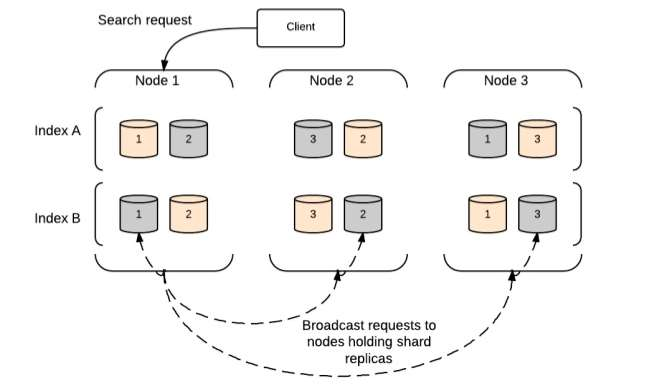
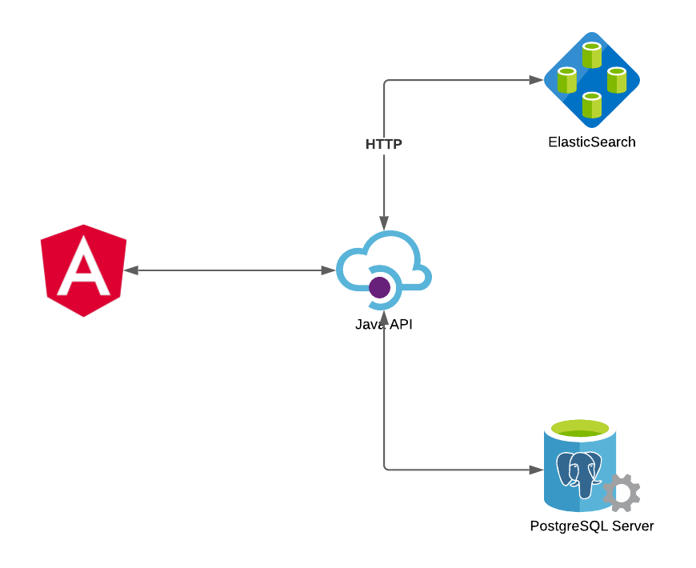
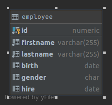
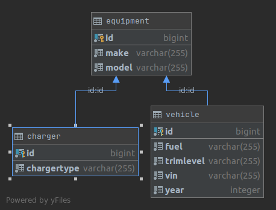

# ElasticSearch POC

Characteristics:
* ElasticSearch is a free and open source distributed inverted index
* Easy to Scale (Distributed)
* RESTful API
* Build on top of Apache Lucene
* Multi-tenancy
* Support for advanced search features (Full Text)
* Per-operation Persistence

Core-Concepts:
* Cluster
* Node
* Index

###Search-Request:


## How this applications works



* All the searches hit only ElasticSearch

## Data models explained

### Employee


### Equipment



## Running the application in dev mode

### Requisites 
* Java 11
* docker
* docker-compose
* curl
* (Optional) elasticvue (https://elasticvue.com/)

You will need first to start the containers using docker-compose.yml
```shell script
docker-compose -f db/docker-compose.yml up
```
Note: It will take some minutes at the first time because it will load 500k records in the database.

You can run your application in dev mode that enables live coding using:
```shell script
./mvnw quarkus:dev
```

After that it will be necessary invoke the rest services to start indexing:
```shell script
curl http://localhost:8080/equipment/sync
curl http://localhost:8080/employee/sync
```
Note: It will take some minutes at the first time because it will load 500k records in the index.


